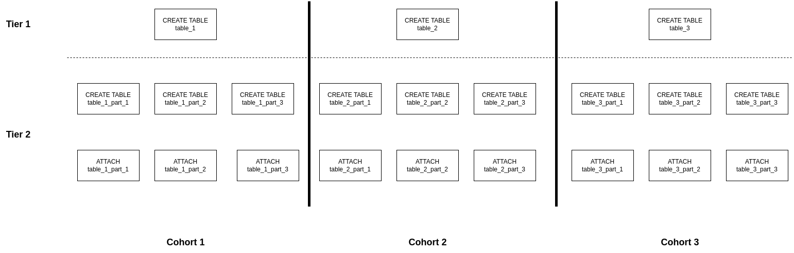

### NOTE:
This is a crosspost of a blog article I wrote for the greenplum.org website.
***

The release of Greenplum Database 7 (GPDB7) brings with it many new features, and each of them
requires some thought to make sure we get the most out of them. Today, I want to talk about the
tweaks we on the Greenplum Kernel team have made to get the most out of the [new partitioning
syntax](https://greenplum.org/partition-in-greenplum-7-whats-new/). Hopefully this will be both
interesting, and useful for any other applications that are looking to interact with partitioned
tables in large numbers.

## Background 
GPDB7 introduces a new syntax for creating and managing partitioned tables, that we are calling
Modern syntax. This should be very familiar to anyone who's worked with PostgreSQL, as it is
identical to theirs. While Greenplum has had its own unique partitioning syntax for quite a while
now (that is now going by the name Classic syntax), we believe that aligning with our upstream will
be very valuable for our users. Additionally Modern syntax is very flexible, and allows a much
clearer way to express variety across leaf tables. This does, however, come at the cost of being
substantially more verbose, which means it requires a bit more finesse to scale up efficiently. In
our tests, this verbosity showed up as substantial performance regressions when restoring large
amounts of metadata using either `gprestore` and `pg_dump`. Obviously, we do not want our shiny new
features to cause performance regressions, so the Kernel team dug in to figure out a way to have
our cake and eat it too.

## Baseline Measurements
I put together an adversarial schema to test this problem, using tables from TPC-DS as a base. It
uses Classic syntax to cause heavy partitioning, with 28 root tables and ~164,000 tables overall.

Here's an example of one of the tables:
```sql
CREATE TABLE wide.orders
(O_ORDERKEY INT,
O_CUSTKEY INT,
O_ORDERSTATUS CHAR(1),
O_TOTALPRICE DECIMAL(15,2),
O_ORDERDATE DATE,
O_ORDERPRIORITY CHAR(15), 
O_CLERK  CHAR(15), 
O_SHIPPRIORITY INTEGER,
O_COMMENT VARCHAR(79))
DISTRIBUTED BY (O_ORDERKEY)
PARTITION BY RANGE (O_ORDERDATE)
(start('1982-01-01') INCLUSIVE end ('2015-12-31') INCLUSIVE every (5),
default partition others);
```

This schema is represented in Classic syntax as 28 `CREATE TABLE` statements and 28 `ALTER OWNER`
statements. In (one possible) implementation of Modern syntax this will need ~164k each of `CREATE
TABLE`, `ALTER OWNER`, and `ATTACH PARTITION` statements. While those initial 28 statements are way
bigger, there's overhead in each statement and it hurts performance. This overhead is what we're
trying to address.

Before diving in to performance work, we need data! We ran the schema into a 3-segment GPDB7
cluster on a developer workstation, backed it up with `gpbackup`, and then restored it with
`gprestore`. Below are time measurements for where we started out with Classic and Modern syntax,
and as you can see we're looking at about a 6.8x slowdown in the simple implementation. More
importantly, this ratio is generally where any other application with a simple implementation will
land, as we were firing off individual statements on a persistent connection.

### Classic Syntax -- 14 minutes
```bash
time gpbackup --dbname=ajr --metadata-only --backup-dir perf_backups
real	0m22.737s
user	0m0.754s
sys	0m0.154s

time gprestore --create-db --redirect-db=ajr_rest --backup-dir perf_backups --timestamp=20230817153445
real	13m43.712s
user	0m0.672s
sys	0m0.388s
```

### Modern Syntax -- 96 minutes
```bash
time gpbackup --dbname=ajr --metadata-only --backup-dir perf_backups
real	0m48.048s
user	0m7.622s
sys	0m2.635s

time gprestore --create-db --redirect-db=ajr_rest --backup-dir perf_backups --timestamp=20230817112323
real	96m1.435s
user	0m13.270s
sys	0m8.043s
```

## So what do we do about it?
In `gprestore`, these tables fall into what we call `pre-data metadata` (or just `predata`) which
is all the metadata that we need to restore before we can pull data in. The way we handle predata
had some room for optimization to address these performance regressions.

### Solution 1: Slap a transaction on it
Historically, we have not wrapped predata restore in transactions. However, each of these `ATTACH
PARTITION` statements has the overhead of a two-phase commit, and those can add up quite a bit.
Wrapping each batch of the DDL in explicit `BEGIN` and `END` statements brings that down to just a
handful of commits. This gets us a lot of the way back to a good place.

```bash
time gprestore --create-db --redirect-db=ajr_rest --backup-dir perf_backups --timestamp=20230817112323
real	31m51.755s
user	0m8.116s
sys	0m8.322s
```

### Solution 2: Parallelize all the things
There is already support in `gprestore` for restoring data in parallel across a configurable number
of connections (the `--jobs` flag), because the data in one table is generally independent from the
data in others, and this usually represents the bulk of the runtime for a restore so there was lots
of incentive to cut it down. Thus far, `gprestore` has run all predata statements in a single
linear fashion. However, there isn't really a reason it couldn't be run in parallel, as many DDL
statements are independent of each other.

To organize how metadata is restored, `gpbackup` already relies on `pg_depend`. This table tracks
every object, and each object it depends on. We use this information to ensure that no object is
restored before its dependencies are available. We accomplish this by using a depth-first search
(DFS) topological sort to walk through the dependencies and get them into a workable order. During
backup we record the intended order of execution for all `predata` statements, and on restore these
are simply executed in the noted order.

To take this approach and enhance it to support parallel restores requires some changes. During
backup, in addition to noting order of execution, we must also preassign the objects to groups in
some way so that the parallel connections don't contend or deadlock each other. We do this in two
parts.

First we record the steps of the DFS, using the depth as a "tier" value. This means that objects
with no dependents will go into the first tier, and each subsequent level of the tree will be in a
subsequent tier. Our metadata restore will then begin and commit a separate transaction for each
tier. This allows us to keep the transactions a bit shorter for better stability in case of errors,
and gives us some room to push things upstream or downstream if we find that the information from
`pg_depend` isn't sufficient for keeping things in the correct order.  However, this does not
actually facilitate parallelism by itself, as the tiers must still go in order. So we want to be
able to split up each tier to be run across multiple connections.

Within each tier, we also assign every object to a "cohort".  This is done by examining the
dependencies of each object, and assigning the whole tree to a specific cohort. Then, if any
subsequent objects have any of their tree already mapped, throwing that object's whole tree in the
same group. Once this is done, we can safely say that within each tier, no object can depend on
anything from any other cohort, and thus each cohort is safe to restore completely independently of
the others.

Pictures being worth many words, Figure 1 is a diagram of how this might look for a simple schema.
Each rectangle formed by a tier+cohort is a single transaction. Each leaf table can be created
independently, but the `ATTACH PARTITION` statements in tier 2 take a `SHARE UPDATE EXCLUSIVE` lock
on the parents from tier 1 and the leaves from tier 2, so they have a shared dependency and must go
in the same cohort or the transactions would deadlock each other trying to get locks already held
elsewhere. Obviously the relationships between objects in a SQL database system can get incredibly
complex, and we won't go into the full details, but you can imagine how easy it would be to wind up
with a deadlock in a schema of production-grade complexity if we had a less conservative approach.



One of the particularly neat things about this is that it provides our Table of
Contents (toc) files a convenient way of seeing exactly how much parallelism is available for any
given backup. The highest observed cohort value for any given tier is the theoretical maximum
number of jobs that metadata restore could put to use.  Here's an example toc entry from our test
backups, showing that we could, in theory, see performance improvements all the way up to 28 jobs.
Don't try that in prod, though...

```yml
- schema: wide
  name: supplier
  objecttype: TABLE
  referenceobject: ""
  startbyte: 13512
  endbyte: 13554
  tier:
  - 1
  - 28
```

On the restore side, then, all we have to do is hand out cohorts to each connection. We do this by
iterating through each object's restore statement, and assigning it to whichever connection its
cohort belongs to. Each time a new cohort is seen, it gets assigned to the connection that
currently has the fewest statements. Once all assignments are made, each connection opens a
transaction and just executes its statements in order, no further logic needed.

Testing with a fairly modest 3 jobs (too many connections will swamp a system in the data restore,
so we need to be cautious) we see that we've gotten the run time almost back to where we were, but
now with the power of our new partitioning approach! Do note that this is in combination with the
transaction improvements discussed above.

```bash
time gprestore --create-db --redirect-db=ajr_rest --backup-dir perf_backups --jobs=3 --timestamp=20230830163152
real	14m15.468s
user	0m7.006s
sys	0m5.994s
```

Now, you can't get a new toy like this and **not** give it a proper test drive, right? So we did
exactly what I said not to above, and tried it out with 28 jobs.

```bash
time gprestore --create-db --redirect-db=ajr_rest --backup-dir perf_backups --jobs=28 --timestamp=20230830163152
real	6m44.285s
user	0m6.964s
sys	0m5.717s
```

From 96 minutes down to under 7. Not too bad!

## Results
So there we have it. With a combination of two different approaches we were able to restore 164,074
tables in just 32 seconds more than we were originally taking, while still supporting the
flexibility and expressiveness of Modern syntax!

## Future work 
To be honest, there's still some performance on the table. It's just a question of triaging the
effort, as there is always a lot to do.

Modern syntax allows leaf tables to have different owners than their root tables, so we can't just
blindly swap over to applying the ownership changes at the root level.  However, we could, on the
backup side, check for ownership heterogeneity and conditionally print only the root table `ALTER
OWNER` statement if it's safe.  That'd be another 164k statements cut out in our test example.

Modern syntax also supports a `CREATE TABLE PARTITION OF` style, which attaches the partition
automatically. This is able to express everything that the `ATTACH PARTITION` version can, but
requires some significant processing logic to get there.  We could rework how `gpbackup` dumps
modern syntax partition tables to use this approach, and cut yet another 164k statements out of our
test example. We're planning to experiment with that, so keep an eye out for a future post, maybe!

